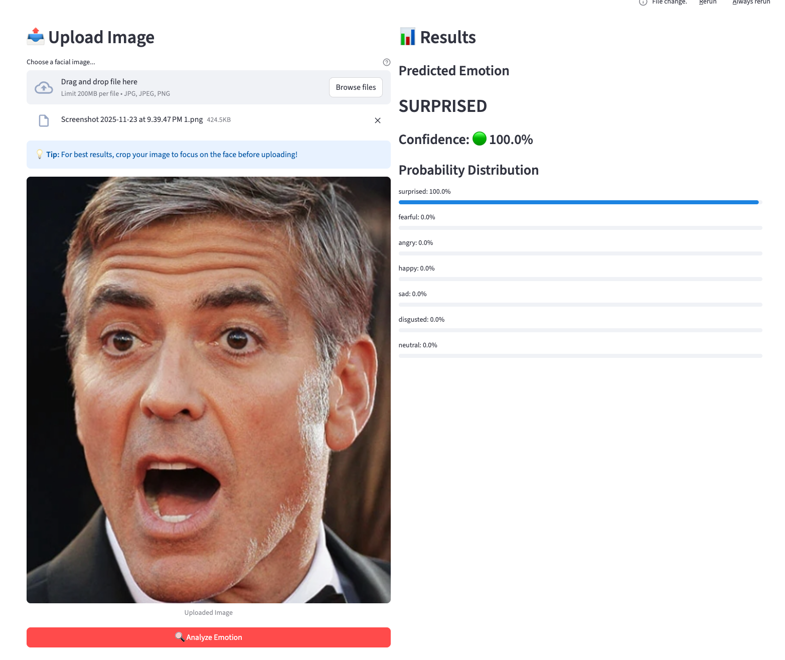
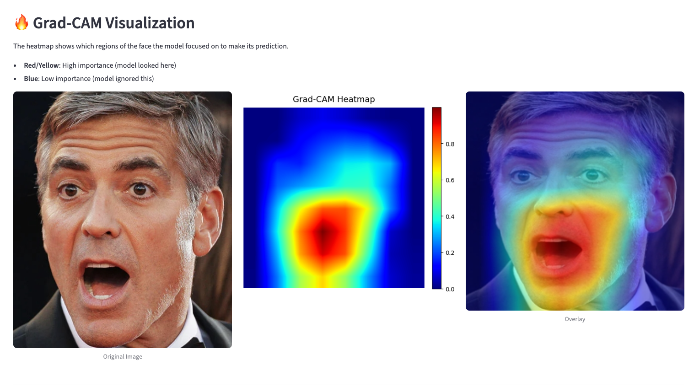

# Explaining Facial Emotion Recognition with Grad-CAM 🔍
[Link to Web App](https://khaeuss808-xai-finalproject-app-bag1kq.streamlit.app/)

This repository contains the code for my final project for **AIPI 590 – Explainable AI** with **Dr. Bent** at **Duke University**.

The accompanying webapp allows users to upload or select images, run the emotion classifier, and view Grad-CAM heatmaps overlaid on the original faces.




---

## 🎯 Project Motivation

Project Goals: Emotion recognition AI is increasingly deployed in hiring, healthcare, education, and law enforcement—high-stakes domains where mistakes have serious consequences. Yet most models are "black boxes" that provide no explanation for their predictions. Even state-of-the-art systems like Meta's DeepFace achieve impressive accuracy, but their internal decision-making processes remain opaque. When a model predicts someone is "angry" or "fearful," we have no insight into whether it's focusing on relevant facial features.  

This project uses Grad-CAM to visualize what a ResNet50 emotion classifier is actually looking at when making decisions. By revealing the model's reasoning process, we can:  

- **Build trust through transparency**  

- **Detect biases** by seeing what features the model relies on

- **Debug failures** by identifying when and why predictions go wrong

- **Ensure fairness** by auditing whether the model uses appropriate facial features

Do models interpret human expressions the way we do?

---

## 🏛️ Model Architecture

The core model is a **ResNet50** classifier fine-tuned for facial emotion recognition.

**Base Architecture**

- Backbone: ResNet50 (50 layers deep)
- Pre-trained on ImageNet (~1.2M images)
- ~23.5M parameters

**Modifications**

- Replaced the final classification layer
- 7 output classes (emotions)
- Fine-tuned on the RAF-DB dataset

**Training Details**

- Optimizer: Adam
- Learning rate: 0.0001 (reduced for fine-tuning)
- Epochs: 15
- Batch size: 32
- Input size: 256×256 (upscaled from 100×100)

**Why ResNet50?**

- Deep architecture captures subtle facial features
- Transfer learning from ImageNet provides strong feature extraction
I experimented with other models, including developing my own CNN from scratch, but found ResNet50 yielded the strongest performance as it already had robust feature extraction capabilities for things like eyes and noses, whereas my CNN struggled and took much longer to learn these features meaningfully. Models like Meta's DeepFace are state of the art in this space, but its architecture is not publicly available, making applying easily interpretable methods like GradCAM difficult.

---

## 📚 Dataset: RAF-DB (Real-world Affective Faces Database)

**Dataset Characteristics**

- Training set: 12,271 images
- Test set: ~3,000 images
- Image size: 100×100 pixels (face-cropped)
- Source: In-the-wild internet images (varied lighting, pose, occlusions)

**Emotion Categories (7)**

1. 😊 Happy  
2. 😢 Sad  
3. 😠 Angry  
4. 😮 Surprised  
5. 😨 Fearful  
6. 🤢 Disgusted  
7. 😐 Neutral  

**Why This Dataset Was Selected:**

- Each image labeled by ~40 independent annotators, so crowdsourced emotion labeling ensures a level of reliability.
- Captures real-world expression variability: lighting, poses, obstructions (glasses, hair, hands), wide range of gender, ages and races.
- Images are in color which I thought would be necessary for future steps of the project where I might explore skin tone biases.

**Citation**

> Li, S., & Deng, W. (2019). Reliable Crowdsourcing and Deep Locality-Preserving Learning for Unconstrained Facial Expression Recognition. *IEEE Transactions on Image Processing*.

---

## 📈 Model Performance

**Overall Test Accuracy:** **82.0%**

**Best-Performing Class**

- 🟢 **Happy** – **92.7%**

**Most Challenging Class**

- 🔴 **Fearful** – **55.4%**

**Accuracy by Emotion**

- 🟢 **Happy:** 92.7%  
- 🟢 **Sad:** 83.5%  
- 🟢 **Surprised:** 83.0%  
- 🟡 **Angry:** 74.7%  
- 🟡 **Neutral:** 70.1%  
- 🟡 **Disgusted:** 66.9%  
- 🔴 **Fearful:** 55.4%  

These results highlight that the model is quite strong on more prototypical expressions, like happiness, and struggles more with subtle or easily confused emotions like fear or disgust, further showing how explainability is particularly important when interpreting model predictions.

---

## 🔍 Explainability: Grad-CAM

**What is Grad-CAM?**
Grad-CAM is a visualization technique that highlights which regions of an image were important for a model's prediction. It was one of my favorite techniques we learned this semester, and I knew I wanted to incorporate it into my final project.

**Why Grad-CAM for Emotion Recognition?**

- Reveals which facial features drive predictions (eyes, mouth, eyebrows)
- Can clearly diagnose diagnose model failures (scattered attention = uncertainty)
- Validates that model uses human-interpretable features
- Builds trust by making "black box" decisions transparent

---

## 🧭 Future Work: Fairness & Demographic Analysis  
Originally, I had intended the focus of this project to be on the differences in accuracy of emotion detection models across different demographic groups (racial, gender, age), inspired in part by my reading of "Unmasking AI" by Joy Buolamwini this semester. However, as I dove deeper into this project, I encountered challenges in finding datasets with the kind of demographic annotations needed to perform the analysis I was interested in. Many popular emotion recognition datasets I considered lack detailed demographic information (FER-2013, RAF-DB), or the demographic datasets I found lacked emotion labeling (UTKFace, FairFace). While completing this project, I considered doing the manual labeling of demographics on the RAF-DB dataset, but I thought this would be innaccurate as race and gender was often hard for me to discern and could lead to me injecting my own implicit biases into the labeling. In the future, expanding this project will require accessing or building a dataset with reliable demographic annotations, enabling a more rigorous investigation into model performance disparities.  

---

## 🚀 Getting Started

### Prerequisites

- Python 3.8+  
- `pip` or `conda` for dependency management  
- (Optional) GPU support for faster inference

### Installation

```bash
# Clone the repository
git clone https://github.com/khaeuss808/XAI_FinalProject.git
cd XAI_FinalProject

# Create and activate a virtual environment
python -m venv .venv
source .venv/bin/activate  # On Windows: .venv\Scripts\activate

# Install dependencies
pip install -r requirements.txt